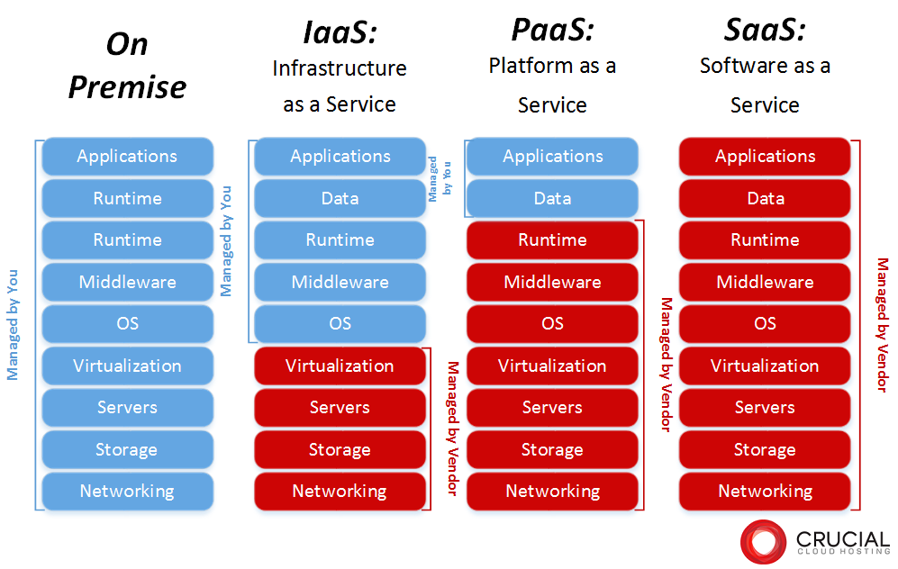

# *Day 1 - Cloud Computing and AWS EC2*

## Cloud Computing

Cloud computing is the delivery of computing services over the internet rather than running them locally on a personal computer or on-premise servers. These services include:

- Servers
- Storage
- Databases
- Networking
- Software
- Analytics
- Artificial Intelligence

Instead of owning physical hardware, users rent computing resources from cloud providers and pay only for what they use.

A system is considered to be **in the cloud** if it has the following characteristics:

- It runs on **remote servers hosted by a cloud provider**
- It is **accessible over the internet**
- Resources can be **scaled up or down on demand**
- Users **pay for usage rather than owning hardware**
- Infrastructure is **managed by the cloud provider**

Example:

- A website hosted on an AWS EC2 server is running **in the cloud**
- A website hosted on a local computer in your house is **not cloud computing**

Approximate market share of major cloud providers (Q4 2025):

- AWS - ~28%
- Azure - ~21%
- GCP (Google Cloud) - ~14%
- Others - ~37%

## Deployment models

### Simple

- Public:
    - infrastructure owned and operated by a third-party provider and shared across many customers
    - shared tenancy: physically shared system
- Private:
    - cloud infrastructure used exclusively by one organisation
    - single tenancy
    - more secure

### Complex

- Hybrid:
    - public + private
    - sensitive data is stored in a private cloud, rest of the infrastucture is stored in public cloud
- Multi:
    - using different cloud providers to leverage the benefits of each
    - also provides a robust environment, eg. if one goes down you are still backed up

---

## Cloud Service Types

---

## Advantages and disadvantages of cloud computing

**Advantages**:
- **Scalability** – resources can increase or decrease based on demand
- **Cost efficiency** – pay only for what you use
- **Accessibility** – services available from anywhere with internet
- **Reliability** – cloud providers offer high availability infrastructure
- **Automatic updates** – infrastructure maintenance handled by provider
- **Speed of deployment** – servers can be launched in minutes

**Disadvantages**:
- **Cost management** – resources left running can become expensive
- **Vendor lock-in** – difficult to migrate between cloud providers
- **Security concerns** – sensitive data stored off-site
- **Internet dependency** – services require a reliable internet connection
- **Limited control** – infrastructure controlled by provider

---
 
## Interacting with the cloud (aws)

- GUI (setup system)
- shell/terminal (interact with the system)

---

## SSH and SSH Key Pairs

### What is SSH?

SSH (Secure Shell) is a secure network protocol used to remotely connect to and manage computers over a network.

SSH allows users to:
- access remote machines
- execute commands remotely
- transfer files securely
- manage servers and infrastructure

SSH authentication using key pairs can be understood using a lock and key analogy. The public key acts like a lock and the private key acts like the key that opens the lock.

How it works:
1. The server stores the public key
2. The user keeps the private key
3. When connecting, the private key proves the user's identity
4. If the key matches the lock, access is granted

This method is significantly more secure than traditional password authentication.

---

## Virtual Machines/Instances

A Virtual Machine (VM) is a software-based computer that runs inside a physical computer.

Each VM behaves like an independent system with its own:
- Operating system
- CPU allocation
- Memory
- Storage

Multiple VMs can run on the same physical hardware

Virtual machines offer several advantages:
- **Efficient resource usage**: multiple virtual systems can share the same hardware.
- **Isolation**: each VM operates independently, preventing issues in one system from affecting others.
- **Rapid deployment**: new servers can be created within minutes.
- **Scalability**: systems can scale easily by launching additional instances.
- **Flexibility**: different operating systems and environments can run on the same hardware.

---

## EC2 - Elastic Compute Cloud

In Amazon Web Services, virtual machines are called EC2 instances.

Elastic: scalable, can be expanded or reduced on demand

EC2 is used to create virtual machines and connect to them through the internet. "Give me a mini computer inside a big host computer that I can access through the internet"

Could be done locally but this takes up resources which are quite finite.

When creating EC2 instances on AWS, several factors must be considered:
1. **Region Selection**
2. **Instance Type**: instance types determine the computing resources allocated to the VM
    - CPU 
    - RAM
    - Network performance
3. **Security Groups**: Security groups act as virtual firewalls that control traffic entering and leaving an EC2 instance. By default everything is allowed out and nothing is allowed in. We set up rules to basically say everything is closed except what is described in the rules.
    - ports: 
        - Ports are logical communication endpoints that allow a device to run multiple network services simultaneously. While an **IP address** identifies a device on a network, a **port number** directs incoming traffic to the correct service or application running on that device.
        - Think of a device as a **large office building**:
            - The **IP address** is the building’s street address.  
            - The **port number** is the office number inside the building.  
        - Ports are numbered from **0 to 65535**, some well known ports include: 22 -> SSH, 80 -> HTTP
4. **Key Pairs**: AWS requires a key pair to connect to instances.
    - public key stored by AWS
    - private key downloaded by the user (store them in Users/username/.ssh)
    - without the private key, the instance cannot be accessed via SSH

---

## EC2 Deployment

 - **Step 1**: Log into AWS
 - **Step 2**: Navigate to EC2 tab and click "Launch Instance"
 - **Step 3**: Name instance and select an Amazon Machine Image (AMI)
 - **Step 4**: Select instance type (eg. t3.micro)
 - **Step 5**: Select or create key pair
 - **Step 6**: Configure network settings and add security groups
 - **Step 7**: Launch instance
 - **Step 8**: Connect to the instance:
    - navigate to /.ssh in bash
    - copy and paste command from instance page