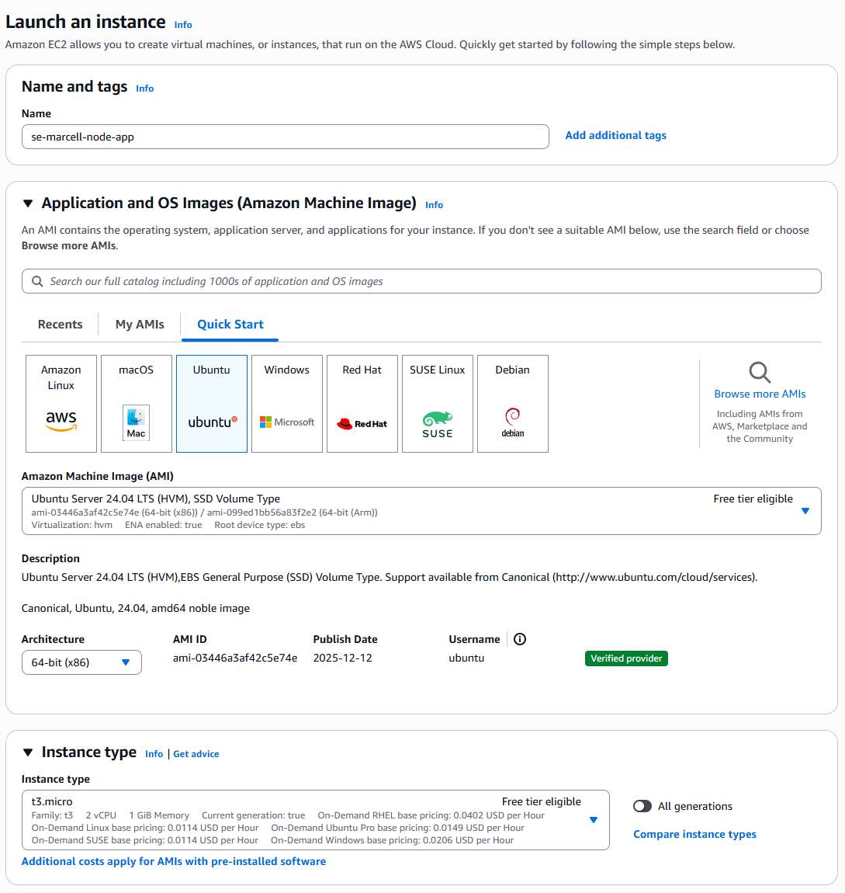
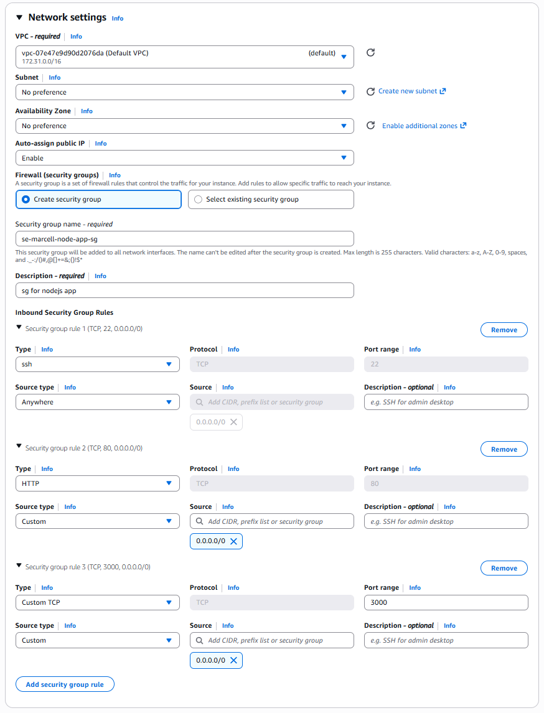
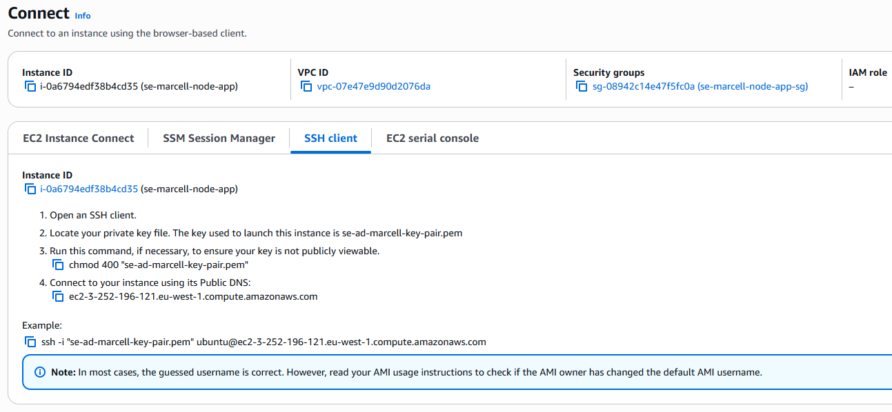
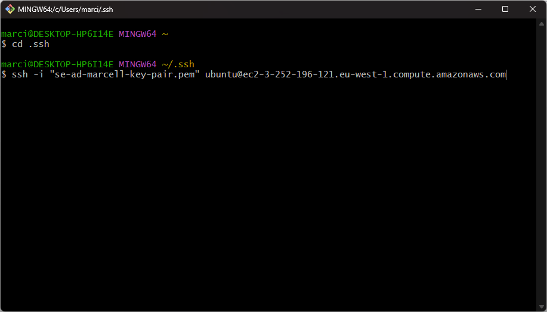

# *Day 2 - Deploying a Node.js Application on AWS EC2*

## Overview

On Day 2, a Node.js v20 application was deployed to an AWS EC2 instance using a setup script. The script automated the installation of required software, cloned the application repository from GitHub, and started the application. The instance was configured with the necessary security group rules to allow remote access and web traffic.

---

# EC2 Security Group Configuration

A **security group** was created to control inbound traffic to the EC2 instance. Security groups act as **virtual firewalls**, allowing or blocking network traffic based on defined rules.

For this setup, the following inbound rules were configured:

| Port | Protocol | Purpose |
|-----|-----|-----|
| 22 | SSH | Allows secure remote access to the server |
| 80 | HTTP | Allows access to the Nginx web server |
| 3000 | TCP | Allows access to the Node.js application |

The **source IP** was set to: 0.0.0.0/0

This means the ports are accessible from **any IP address**. While this is acceptable for testing or development environments, it is generally not recommended for production systems due to security risks.

---

# Application Deployment Script

The Node.js application was deployed using a Bash script that automated the server setup and application launch process.

The script performs the following tasks:

1. **System update**
   - Updates the package list.
   - Upgrades installed packages to the latest versions.

2. **Install and configure Nginx**
   - Installs the Nginx web server.
   - Restarts the Nginx service.
   - Enables Nginx to start automatically when the system boots.

3. **Clone the application repository**
   - The Node.js project is downloaded from GitHub using `git clone`.

4. **Install Node.js v20**
   - Adds the NodeSource repository.
   - Installs Node.js version 20 using the package manager.

5. **Run the application**
   - Navigates to the application directory.
   - Starts the Node.js server.

Once running, the Node.js application listens on **port 3000**.

---

# Accessing the Application

After deployment, the application can be accessed using the public IP address of the EC2 instance.

Example: http://EC2_PUBLIC_IP:3000

Because a reverse proxy has **not yet been configured**, the application is accessed directly through port **3000** rather than through Nginx on port **80**.

At this stage:

- Nginx is installed and running.
- The Node.js application runs independently on port **3000**.
- Traffic goes directly to the application server.

---

# What is DevOps?

DevOps is a set of practices that combines **software development (Dev)** and **IT operations (Ops)** to improve the speed and reliability of software delivery.

It is closely tied to the **Software Development Life Cycle (SDLC)**, as DevOps practices aim to **streamline and automate stages of the SDLC**, including development, testing, deployment, and maintenance.

Traditionally, development and operations teams worked separately. Developers would write code, and operations teams would deploy and maintain the systems. This often led to slow releases and communication issues.

DevOps aims to solve this by promoting:

- **Automation** of infrastructure and deployments
- **Continuous integration and continuous delivery (CI/CD)**
- **Collaboration between development and operations teams**
- **Monitoring and rapid feedback**

In practice, DevOps engineers use tools such as cloud platforms, scripting, and automation to ensure that applications can be **built, tested, and deployed quickly and reliably**.

---

# Bash commands for app deployment task

- copy file/folder from local machine to instance:
    - `scp -i /private/key/path.pem /file/to/be/copied/path ubuntu(username)@PUBLIC-IP-ADDRESS:/home/ubuntu`

- install unzipping package: `sudo apt install unzip -y`
    - to use it: `sudo unzip nameoffile.zip`

- create script in bash (to install nginx):
    1. create .sh file:
        - `sudo nano deploy-nginx.sh`
        - copy paste script content
    2. deploy script:
        - `source deploy-nginx.sh`
    3. (optional) check if setup was successful:
        - `sudo systemctl status nginx`

- install specific version of node.js (v20.x)
    - `sudo bash -c "curl -fsSL https://deb.nodesource.com/setup_20.x | bash -"`
    - `sudo apt install nodejs -y`
    - `node --version`

- deploying the app
    1. cd to app directory
    2. `sudo npm install`
        - installs packages listed in package.json
    3. `npm start app.js`

---

# EC2 Instance Creation for the NodeJs v20 app

### Step 1:

Name the instance and choose AMI and instance type

### Step 2:

Create security group with necessary ports "opened"

### Step 3:

Launch the instance, *cd* into /.ssh directory, and connect to the VM using the ssh command under the ssh tab on the connect page

