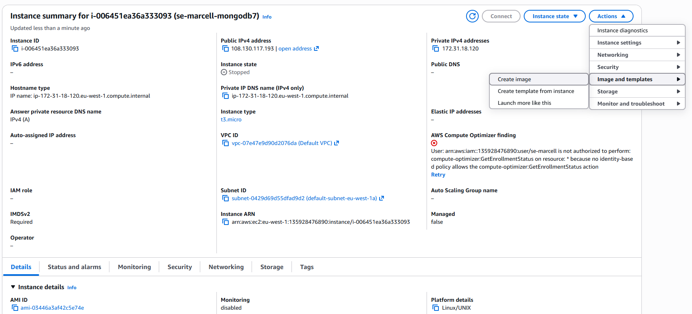
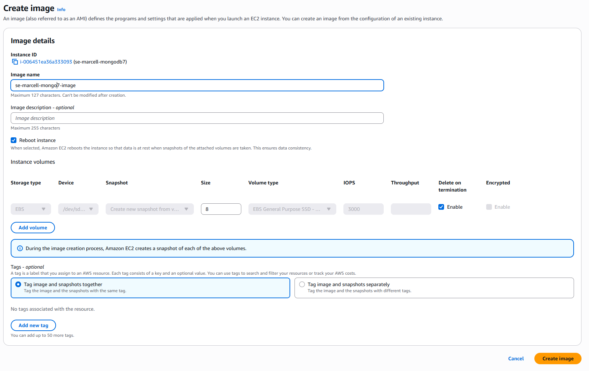
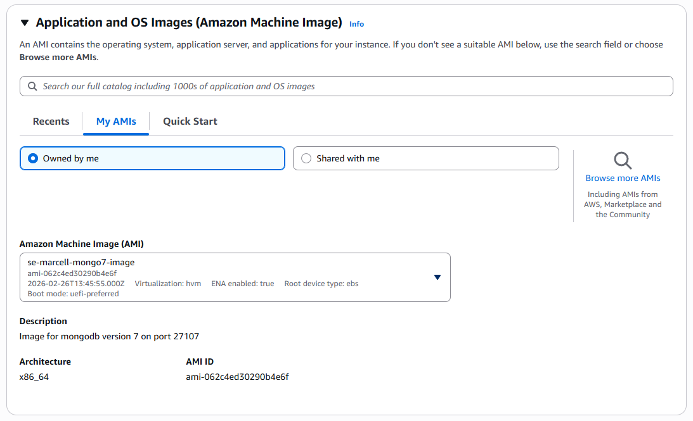

# Day 4 - Custom AMIs and Basic Monitoring

## Custom AMI Images

An **Amazon Machine Image (AMI)** is a template used to create EC2 instances. It contains the information required to launch a virtual server, including:

- Operating system
- Installed software
- Application code
- Configuration settings

AWS provides many **prebuilt AMIs** (for example Ubuntu or Amazon Linux), but it is also possible to create **custom AMIs** from existing instances.

### Why Use Custom AMIs?

Custom AMIs allow you to save a fully configured server and reuse it later. This is useful because:

- New instances can be launched **quickly without repeating setup steps**
- Ensures **consistent environments** across multiple servers
- Reduces **manual configuration errors**
- Speeds up infrastructure deployment

For example, after configuring an application server with Node.js, Nginx, and application code, a custom AMI can be created. New servers launched from this AMI will already contain the full configuration.

---

## Creating a Custom AMI

To create a custom AMI from an EC2 instance:

1. Open the **EC2 Dashboard** in the AWS Console.
2. Select the configured EC2 instance and stop it.
3. Click **Actions → Image and Templates → Create Image**.
4. Provide an **image name and description**.
5. Click **Create Image**.

AWS will create an AMI based on the current state of the instance which can be selected when launching a new instance.

---

### Image Creation Screenshots

#### Creating the AMI

#### AMI Creation Progress

### AMI Selection

---

## Basic Monitoring in AWS

AWS provides built-in monitoring tools to track the performance and health of cloud resources.

The primary service used for monitoring EC2 instances is **Amazon CloudWatch**.

### What CloudWatch Monitors

CloudWatch automatically collects several metrics from EC2 instances, including:

| Metric | Description |
|------|------|
| CPU Utilization | Percentage of CPU usage |
| Network In | Incoming network traffic |
| Network Out | Outgoing network traffic |
| Disk Read/Write | Disk activity |
| Status Checks | Instance health checks |

These metrics help administrators monitor server performance and detect potential issues.

---

### Why Monitoring is Important

Monitoring is important for maintaining reliable systems because it allows engineers to:

- Detect **performance issues**
- Identify **high resource usage**
- Monitor **application health**
- Troubleshoot problems quickly
- Set **alerts and alarms** when thresholds are exceeded

For example, if CPU usage becomes very high, CloudWatch can trigger an **alarm** to notify administrators.
